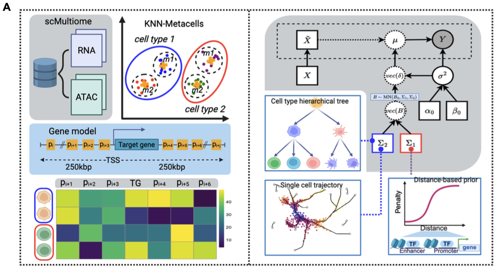
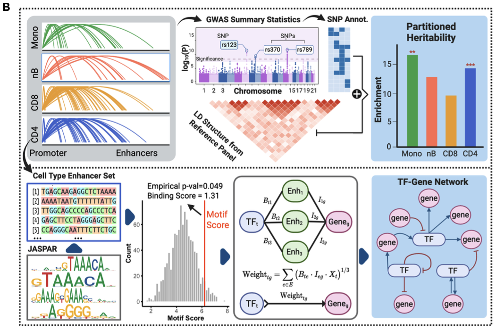

# BayesCNet

**B**ayesian **C**ell-type-specific **Net**work Inference from Single-cell Multi-omics Data

## Overview


BayesCNet infers cell-type-specific gene regulatory networks from paired single-cell RNA-seq and ATAC-seq data. It uses a hierarchical Bayesian framework that leverages cell type relationships to improve network inference accuracy.



The inferred cell-type-specific cis-regulatory networks support downstream analyses, including: Heritability enrichment analysis using stratified linkage disequilibrium score regression (S-LDSC); TF–gene network construction, where transcription factors are connected to target genes through predicted enhancer elements, integrating motif binding predictions and TF expression.
## Installation

```r
# Install from GitHub
# install.packages("devtools")
devtools::install_github("fzhaouf/BayesCNet")
```

## Quick Start

### Load Demo Data

```r
library(BayesCNet)

# Download demo PBMC data (hosted separately due to size)
# This subset contains 4 cell types: CD16 Mono, CD4 TEM, CD8 TEM_1, Naive B
download.file("https://www.dropbox.com/scl/fi/ixdlcc1qkodtb3yy28zsu/pbmc_demo.rds?rlkey=aoxo00ckfnqddfwgx89g93l71&dl=0",
              "pbmc_demo.rds")
pbmc_subset <- readRDS("pbmc_demo.rds")  # loads pbmc_subset object

# Check the data
table(pbmc_subset$celltype)
# CD8 TEM_1   CD4 TEM   Naive B CD16 Mono 
#       302       542       145       521
```

### Complete Analysis Pipeline

```r
# Step 1: Create BayesCNet object from Seurat
bcnet <- CreateBayesCNet(pbmc_subset, cell_type_col = "celltype")

# Alternative: Create from matrices
# rna_counts <- as.matrix(GetAssayData(pbmc_subset, assay = "RNA", slot = "counts"))
# atac_counts <- as.matrix(GetAssayData(pbmc_subset, assay = "ATAC", slot = "counts"))
# cell_meta <- pbmc_subset@meta.data
# cell_meta$cell_type <- cell_meta$celltype
# bcnet <- CreateBayesCNetFromMatrices(rna_counts, atac_counts, cell_meta)

# Step 2: Define cell type hierarchy
# Using full PBMC hierarchy
edges <- c("HSPC", "Monocytes",
           "HSPC", "T Cells",
           "HSPC", "B Cells",
           "Monocytes", "CD14 Mono",
           "Monocytes", "CD16 Mono",
           "T Cells", "CD4 T Cells",
           "T Cells", "CD8 T Cells",
           "CD4 T Cells", "CD4 Naive",
           "CD4 T Cells", "CD4 TCM",
           "CD4 T Cells", "CD4 TEM",
           "CD8 T Cells", "CD8 Naive",
           "CD8 T Cells", "CD8 TEM_1",
           "CD8 T Cells", "CD8 TEM_2",
           "B Cells", "Naive B",
           "B Cells", "Memory B")

bcnet <- AddCellTypeHierarchy(bcnet, edges, lambda = 1.0)

# Step 3: Add gene annotation
# Using EnsDb for human gene annotations
library(EnsDb.Hsapiens.v86)

# Get TSS information for protein-coding genes
edb <- EnsDb.Hsapiens.v86
transcripts_info <- transcripts(edb, 
                                filter = TxBiotypeFilter("protein_coding"),
                                columns = c("gene_name", "tx_seq_start", "tx_cds_seq_start"))

# Extract TSS positions
tss_pos <- ifelse(strand(transcripts_info) == "+", 
                  start(transcripts_info), 
                  end(transcripts_info))

# Create annotation dataframe
gene_annotation <- data.frame(
  gene = mcols(transcripts_info)$gene_name,
  chr = paste0("chr", seqnames(transcripts_info)),
  tss = tss_pos,
  stringsAsFactors = FALSE
)

# Keep unique genes and regular chromosomes
gene_annotation <- gene_annotation[!duplicated(gene_annotation$gene), ]
regular_chr <- paste0("chr", c(1:22, "X", "Y"))
gene_annotation <- gene_annotation[gene_annotation$chr %in% regular_chr, ]

bcnet <- AddGeneAnnotation(bcnet, gene_annotation)

# Step 4: Aggregate cells into metacells
bcnet <- AggregateByKNN(bcnet, k = 50, max_overlap = 0.8)

# Step 5: Select variable genes
# Method 1: Find cell type markers
bcnet <- AddVariableGenes(bcnet, 
                         method = "markers", 
                         min.pct = 0.01, 
                         logfc.threshold = 0.01)

# Method 2: Use custom gene list
# custom_genes <- c("IL2", "CD4", "CD8A", "MS4A1", "GNLY")
# bcnet <- AddVariableGenes(bcnet, method = "custom", genes = custom_genes)

# Step 6: Check readiness
IsReadyForInference(bcnet)

# Step 7: Run Bayesian inference
# For testing, use fewer genes and smaller window
if (length(bcnet@variable_genes) > 20) {
  bcnet@variable_genes <- bcnet@variable_genes[1:20]
}

bcnet <- RunBayesCNet(bcnet, 
                     window = 100000,  # 100kb for faster testing
                     cores = 1,        # Increase for real analysis
                     verbose = TRUE)
```

### Analyze Results

```r
# Get all networks
all_networks <- GetAllNetworks(bcnet)
head(all_networks)

# Get cell-type-specific network
cd4_network <- GetCellTypeSpecificNetwork(bcnet, "CD4 TEM")
naive_b_network <- GetCellTypeSpecificNetwork(bcnet, "Naive B")

# Filter by importance score
high_confidence <- all_networks[all_networks$Importance > 2, ]

```

## Full Analysis Parameters

For production analysis, use full parameters:

```r
# Use all variable genes
bcnet <- AddVariableGenes(bcnet, method = "markers")

# Run with larger window and parallel processing
bcnet <- RunBayesCNet(bcnet,
                     window = 250000,  # 250kb regulatory window
                     cores = 8,        # Parallel processing
                     regularization = 1e-6)
```

## Key Functions

### Object Creation
- `CreateBayesCNet()` - Create from Seurat object
- `CreateBayesCNetFromMatrices()` - Create from count matrices

### Data Preparation
- `AddCellTypeHierarchy()` - Define cell type relationships
- `AddGeneAnnotation()` - Add gene TSS information
- `AggregateByKNN()` - Create metacells
- `AddVariableGenes()` - Select genes for analysis

### Inference
- `RunBayesCNet()` - Run Bayesian network inference

### Results Access
- `GetAllNetworks()` - Get all inferred connections
- `GetCellTypeSpecificNetwork()` - Get network for one cell type

### Utilities
- `IsReadyForInference()` - Check if object is ready
- `GetRNA()`, `GetATAC()`, `GetCellMetadata()` - Access data slots

## Output Format

The results data frame contains:
- **CellType**: Cell type for this connection
- **Gene**: Target gene being regulated
- **Peak1**: Promoter region
- **Peak2**: Enhancer region
- **Pmean**: Posterior mean of regulatory coefficient
- **Pvar**: Posterior variance (uncertainty)
- **Importance**: Importance score

Higher importance scores indicate stronger, more confident regulatory connections.

## Requirements

- R >= 4.0.0
- Seurat >= 4.0.0
- Signac >= 1.13.0
- See DESCRIPTION for full dependency list

## Citation

If you use BayesCNet, please cite:

## Issues and Support

Please report issues on [GitHub](https://github.com/fzhaouf/BayesCNet/issues).

## License

MIT
